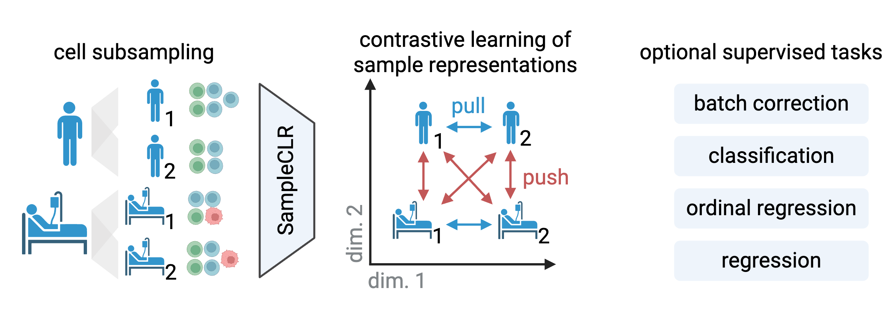

# Great patients embed alike: contrastive learning for sample representation from single-cell data

Single-cell transcriptomics has revolutionized cellular biology by measuring gene activity in thousands of cells per donor, giving insights into cellular processes in normal tissue and early-stage disease. Sample representation methods encode all cells from one patient as a single patient vector, enabling applications of single-cell data for health state classification, prediction of future clinical status, and patient stratification. However, current single-cell datasets have fewer than a thousand samples, making it challenging for the models to learn generalisable and robust sample representations. To overcome this limitation, we suggest learning sample representations in a self-supervised way, relying on set representation invariance to subsampling. We develop SampleCLR, a contrastive learning method, which can be extended to supervised task prediction by the multiple instance learning framework. We show that SampleCLR outperforms unsupervised methods when trained in a self-supervised way, and reaches state-of-the-art quality of sample representation when fine-tuned on a supervised task, despite having orders of magnitude fewer parameters than other methods. We further demonstrate that SampleCLR is interpretable by design via the cell importance module and learns signatures of COVID-19 severity. We envision SampleCLR to pave the way for diagnostic applications from single-cell data


* Cells from samples are randomly subsampled to form positive and negative pairs, and sample representations are learned
in a contrastive way with optional supervised tasks on top*

---

## Features

- **Two-stage training**: contrastive pretrain → supervised/joint fine-tune (with early stopping).
- **Multi-head cell aggregation** (optionally with Gumbel Softmax and a diversity regularizer).
- Task heads for **classification**, **regression**, **ordinal regression**.
- Optional **batch-invariant** embeddings using a **GRL** discriminator.
- main **XSampleCLR** loss, **InfoNCE** family of losses (default: **Cauchy** variant).
- Utilities for **KNN/NN evaluation**, **UMAP** plots, and **training curves**.

---

## Installation

### Option A — `uv` (fast, reproducible)
```bash
curl -LsSf https://astral.sh/uv/install.sh | sh
uv venv .venv
source .venv/bin/activate
uv pip install -e .
```

### Option B — pip
```bash
python -m venv .venv
source .venv/bin/activate
pip install -e .
```

> **PyTorch**: install the build matching your CUDA/OS.  
> **Python**: 3.10+ recommended. GPU optional but highly recommended.

---

## Repository Structure

```
.
├── src
│   └── sampleclr
│       ├── __init__.py
│       ├── contrastive_model.py # High-level trainer (ContrastiveModel), staging, early stopping, evaluation
│       ├── datasets.py # SamplesDataset (per-sample tensors), TransformedPairDataset (two random augmented views)
│       ├── losses.py # main **XSampleCLR** loss, InfoNCE variants (Cauchy/Gaussian/Cosine), ordinal loss.
│       ├── models.py # Aggregator, projector, classifier/regression/ordinal heads, GRL discriminator
│       └── utils.py # KNN/NN eval, batch leakage score, UMAP, training/metric plots, embeddings IO
        
```

### Model configs
We ship **three example model sizes** in `configs/models/`:
- `tiny.json` (used in the Quickstart below)  
- `middle.json`  
- `large.json`

---

## Quickstart (Python API) (using config `tiny.json`)

```python
import json, torch, scanpy as sc, pandas as pd
from sampleclr.contrastive_model import ContrastiveModel
from sampleclr.utils import get_sample_representations

# 1) Load data
adata = sc.read_h5ad("path/to/your.h5ad")
sample_key = "sample_id"
layer = "X_pca"

# 2) Define tasks (use what you need)
tasks = {
    "classification": ["Source"],
    # "regression": ["Age"],
    # "ordinal_regression": ["Outcome"],
    # "batch_correction": "Pool_ID",
}

# 3) (Optional) split by patient ids
donors = adata.obs[sample_key].unique()

# 4) Sample similarity graph if using main XSampleClr loss, otherwise uses identity matrix
prior_distance_matrix = adata.uns["prior_sample_distances"]
similarity_graph = np.exp(-prior_distance_matrix / 5)

# 5) checkout the parameters for different size of model in 'configs/models/'
with open("configs/models/tiny.json") as f:
    cfg = json.load(f)

model = ContrastiveModel(
    adata=adata,
    sample_key=sample_key,
    batch_size= 32, #tune based on your dataset
    tasks=tasks,
    layer=layer,
    device=torch.device("cuda" if torch.cuda.is_available() else "cpu"),
    n_cells_per_sample= [1000, 2000], # range of minimum and maximum number of cells to subsample randomly for each batch or a fix number of cells ,e.x 1000,
    train_ids=donors,
    # val_ids: None, also add val_ids if you wanna use early stopping, etc.,
    sample_similarity_graph=similarity_graph,
    **cfg
)

# 6) choose for unsupervised or jointly supervised and unsupervised training
#example for only unsupervised -> set two_stages to False and stage_2 to "contrastive" :

best_state, best_val_loss, num_epochs_stage1_trained, num_epochs_stage2_trained = model.train(
    num_epochs_stage1=100,
    num_epochs_stage2=100,
    two_stages=False,
    stage_2="contrastive",
    verbose=False,
    stage1_val_metric="loss",
    stage2_val_metric="loss"
)

#example for joint training:

best_state, best_val, e1, e2 = model.train(
    num_epochs_stage1=100,
    num_epochs_stage2=100,
    two_stages=True,                     # contrastive and then contrastive together with supervised stage
    stage_2="joint", 
    stage1_val_metric="loss",
    stage2_val_metric="total",
    verbose=False,
)

# 7) getting embeddings

#give it any dataset split you want to get embeddings for by creating a dataset object like following: below the "ds_all" is the same as model.train_dataset since we are using all sample for training in this example.

all_ids = list(model.metadata_all.index.astype(str))
from sampleclr.datasets import SamplesDataset
ds_all = SamplesDataset(
    data=model.adata,
    unique_categories=all_ids,
    sample_col=model.sample_key,
    classification_cols=None,
    regression_cols=None,
    ordinal_regression_cols=None,
    batch_col=None,
    layer=model.layer,
)

# Simple KNN/NN Evaluation, you can evaluate on more targets if you specify extra_covariates list parameter when constructing the model, otherwise evaluation is done based on the given covariate in given tasks when running supervised version.

results = {}
results["train"] = model.evaluate_split(
    model.train_dataset,
    model.metadata_all.loc[model.train_dataset.unique_categories],
    model.train_dataset,
    model.metadata_all.loc[model.train_dataset.unique_categories]
) if model.train_dataset is not None else {}
results["val"] = model.evaluate_split(
    model.train_dataset,
    model.metadata_all.loc[model.train_dataset.unique_categories],
    model.val_dataset,
    model.metadata_all.loc[model.val_dataset.unique_categories]
) if model.val_dataset is not None else {}


# 8)
reps = get_sample_representations(model.projector, model.aggregator, ds_all, device=model.device) 


```
---
